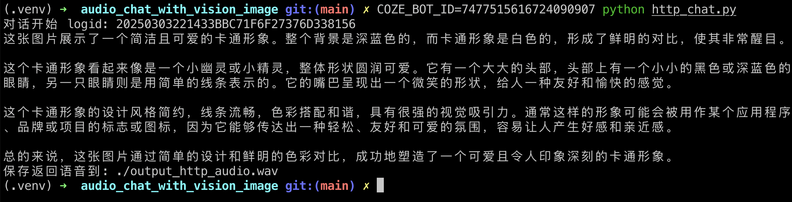
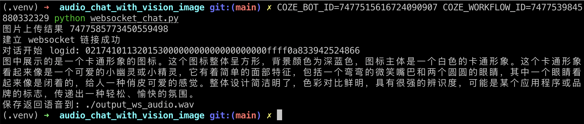

# 使用语音和图片理解大模型对话

本示例会从使用语音和图片理解大模型对话、在 API 中使用来详细的讲解语音 + vision 模型的定位和使用。

详细参考文档: [如何使用语音和图片理解大模型对话](https://bytedance.larkoffice.com/docx/ImBYdsyukoqoRqxoCs7cB9Dcngz)

## 配置说明

首先需要按照 [如何使用语音和图片理解大模型对话](https://bytedance.larkoffice.com/docx/ImBYdsyukoqoRqxoCs7cB9Dcngz) 来设置智能体和对话流，确保和教程中的示例一致。

然后将智能体发布为 API 服务，记录下智能体的 ID、工作流的 ID，并在 [扣子个人访问令牌](https://www.coze.cn/open/oauth/pats) 申请一个个人访问令牌。

## 运行教程

配置 python 虚拟环境:

```bash
python -m venv ./.venv
```

启动虚拟环境:

```bash
source ./.venv/bin/activate
```

安装依赖:

```bash
pip install -r requirements.txt
```

## 运行智能体 + HTTP /v3/chat

运行脚本:

```bash
# 运行智能体 + HTTP /v3/chat
COZE_API_TOKEN=扣子令牌 COZE_BOT_ID=智能体_ID python http_chat.py
```




## 运行对话流 + Websocket /v1/chat

```bash
# 运行对话流 + Websocket /v1/chat
COZE_API_TOKEN=扣子令牌 COZE_BOT_ID=智能体_ID COZE_WORKFLOW_ID=对话流_ID python websocket_chat.py
```


