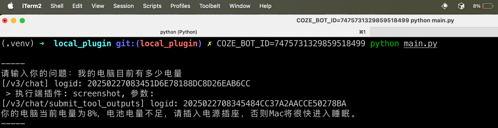
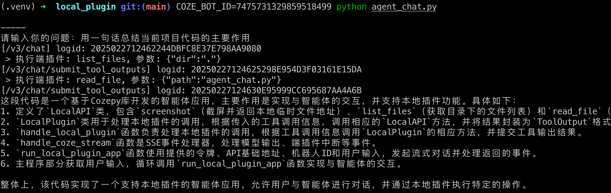

# 端插件使用示例

本示例会从端插件介绍、创建端插件、关联端插件和智能体、如何从需求出发拆解任务为端插件、在 API 中使用端插件几个维度来详细的讲解端插件的定位和使用。

详细参考文档: [扣子中如何使用端插件，让智能体与本地设备交互?](https://bytedance.larkoffice.com/docx/AAAedsXYAolDEVx47yJcsth2nrd)

## 配置说明

首先堵着需要按照 [扣子中如何使用端插件，让智能体与本地设备交互?](https://bytedance.larkoffice.com/docx/AAAedsXYAolDEVx47yJcsth2nrd) 来设置端插件和智能体，确保和教程中的示例一致。

然后将智能体发布为 API 服务，记录下智能体的 ID，并在 [扣子个人访问令牌](https://www.coze.cn/open/oauth/pats) 申请一个个人访问令牌。
 
## 运行教程

配置 python 虚拟环境:

```bash
python -m venv ./.venv
```

启动虚拟环境:

```bash
source ./.venv/bin/activate
```

安装依赖:

```bash
python -m pip install poetry
poetry install
```

运行脚本:

```bash
COZE_API_TOKEN=扣子令牌 COZE_BOT_ID=智能体_ID python agent_chat.py
```

## 运行效果

在下面的示例中，分别运行了三个命令:

- 我的电脑目前有多少电量
- 用一句话总结当前项目代码的主要作用

调用了三个端插件来完成了电脑信息分析和文件总结的任务。



